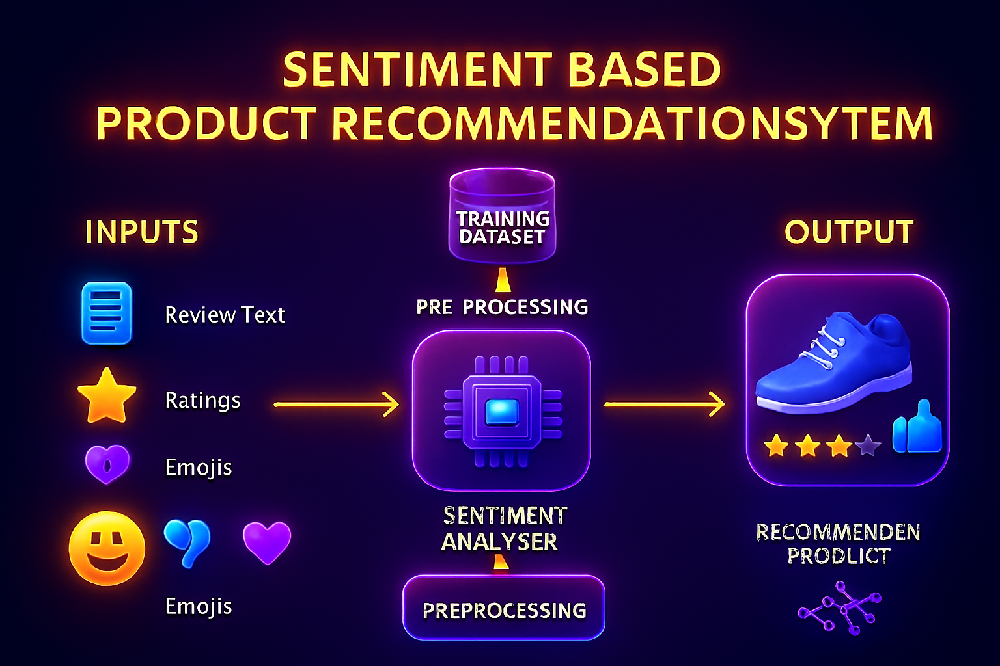
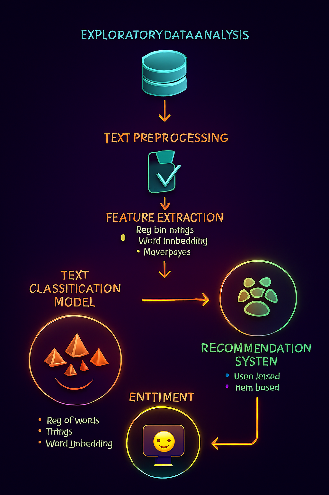

# Sentiment_Based_Product_Recommendation_System
Sentiment Based Product Recommendation System

### Problem Statement

The e-commerce business is quite popular today. Here, you do not need to take orders by going to each customer. A company launches its website to sell the items to the end consumer, and customers can order the products that they require from the same website. Famous examples of such e-commerce companies are Amazon, Flipkart, Myntra, Paytm and Snapdeal.

 

Suppose you are working as a Machine Learning Engineer in an e-commerce company named 'Ebuss'. Ebuss has captured a huge market share in many fields, and it sells the products in various categories such as household essentials, books, personal care products, medicines, cosmetic items, beauty products, electrical appliances, kitchen and dining products and health care products.

 

With the advancement in technology, it is imperative for Ebuss to grow quickly in the e-commerce market to become a major leader in the market because it has to compete with the likes of Amazon, Flipkart, etc., which are already market leaders.

### Existing Challenges

Some of the major challenges faced by new or growing e-commerce platforms include:

1. High competition from leading platforms equipped with AI-powered recommendation systems.
2. Lack of personalized user experiences leading to poor engagement and higher bounce rates.
3. Difficulty in analyzing customer behavior from raw clickstream and purchase data.
4. Limited ability to process large or unstructured datasets for accurate recommendations.
5. Absence of scalable and automated ML pipelines that improve with user activity.
6. Low customer retention due to generic product listings.

### Project Goals

The main objectives of this project are:

1. To design and build a reliable and scalable machine learning-based **product recommendation system** for e-commerce platforms.
2. To analyze user interaction data and derive meaningful insights that support **personalized product discovery**.
3. To improve user engagement, reduce bounce rate, and enhance product visibility through **relevant, data-driven suggestions**.
4. To explore and compare multiple recommendation techniques such as **Collaborative Filtering and Content-Based Filtering**.
5. To analyze **User-based recommendation system** & **Item-based recommendation system** and select the one that is best suited in this case. 
6. To develop a system that can be potentially **integrated into real-world e-commerce applications**.
7. To lay foundational work for **advanced intelligent e-commerce personalization systems**.

### Project Overview

The objective of this project is to design and implement a **data-driven product recommendation system** using real e-commerce data to enhance customer engagement, increase product visibility, and improve conversion rates.

The workflow includes:

- Data preprocessing and feature engineering
- Exploratory data analysis (EDA)
- Model development using appropriate recommendation techniques
- Evaluation and performance measurement
- Implementation of a deployable recommendation framework

The final system empowers users to discover relevant and personalized product suggestions, enhancing their overall shopping experience.

### End to End workflow

### Key Features

This project and the recommendation system aim to include the following features:

- **Data-Driven Recommendation Engine:** Utilizes real dataset insights to generate meaningful product suggestions.
- **Personalized User Experience:** Suggestions tailored to user preferences, browsing history, or similar user profiles.
- **Multiple Recommendation Techniques:** Support for Collaborative Filtering, Content-Based models, or hybrid approaches.
- **Scalable ML Pipeline:** Framework that can be extended or integrated into live platforms.
- **Exploratory Insights Visualization:** Charts and summaries that explain data behavior, product demand, and category popularity.
- **Reusable & Modular Code Design:** Ensures the model can be improved, retrained, or replaced easily.
- **Deployment-Ready Prototype:** Can be converted into API endpoints or integrated into UI/UX systems.

### Final Inferences

#### Best suited ML model

**Random Forest is the best overall model** after hyperparameter tuning due to the highest recall, top-tier F1 performance, and strong ROC-AUC score.  
**XGBoost remains a close second**, suitable for scenarios requiring tunability or large-scale optimization, while **Logistic Regression excels in high-precision use cases only**.

#### Best suited Recommendation Model

- To get the best recommendation model, we will use RMSE (Root Mean Square Error) scores for both user-user and item-item based recommendation systems and do a comparison of the values.
- The recommendation model with the least RMSE will be selected as the best recommendation model.
- Best-fit model is user-user recommendation system